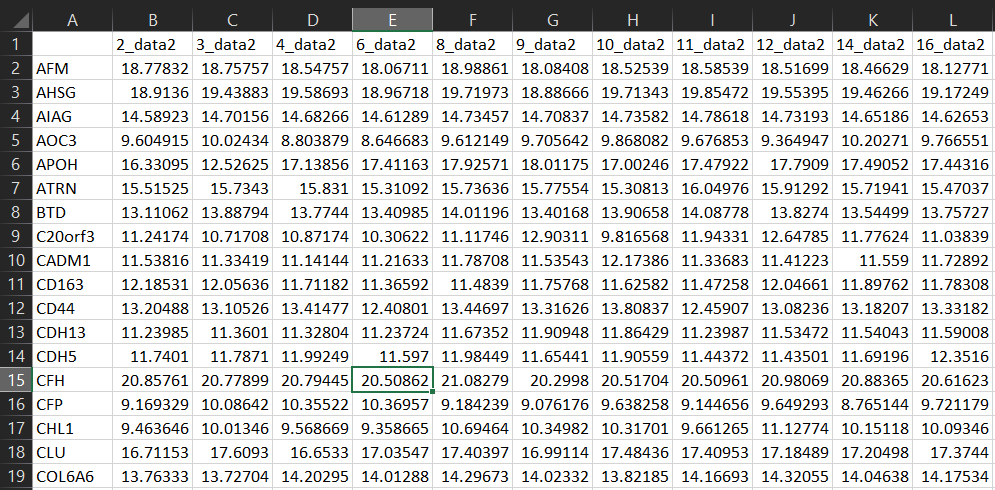
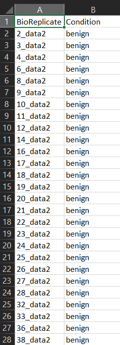

# Import Data  

Begin by importing your dataset from the Import Data submenu in the sidebar.  
Input data must have:  
1. Preliminary data file: must be a .csv file in a “wide” format. Rows are 
proteins, columns are Biological replicates or samples, cells are protein 
abundances. Here is an example preliminary data file (Add a file link here):
  

  

2. Annotation file: must be a .csv file in a “long” format. It includes columns
BioReplicate for sample ID and Condition for group information. BioReplicate 
information should be the same as the column names of Preliminary data. Here is 
an example annotation file  

  

An example dataset from `MSstatsSampleSize` is also available from within the app.
Click Select Data type and select Example from MStatsSampleSize to start exploring `MSstatsSampleSize-GUI`.